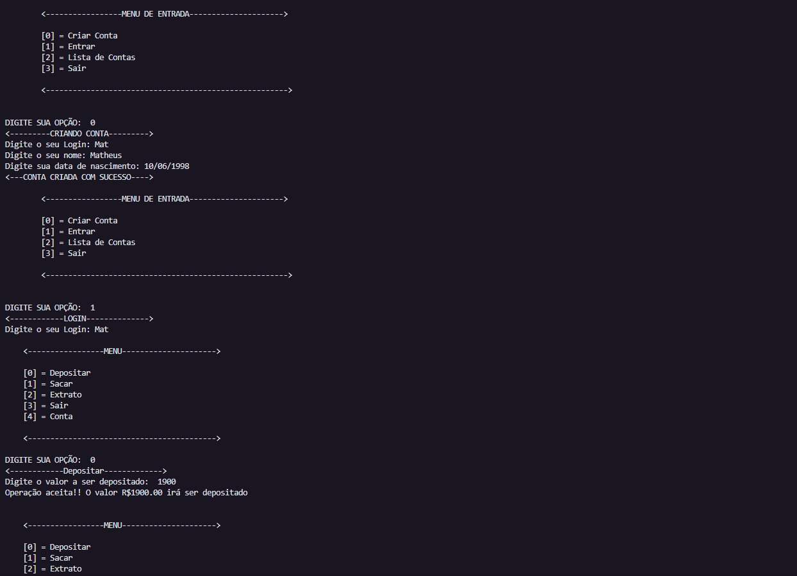

# Exercício Banco Simples

<h1 align="left">Olá , Este meu segundo exercício com python</h1>

Para esse projeto foram utilizadas as seguintes informações:  
- Faça uma versão intermediária de uma relação bancario. Onde deve ser possível a criação de uma conta/usuário que possa fazer o depósito de um valor positivo na sua conta bancária. Todos os depósitos devem ser armazenados em uma variável e exibidos na operação do extrato. 
- A segunda parte do exercício é, deve-se permitir realizar 3 saques diários com limite máximo de 500 reais por saque. Caso o usuário não tenha saldo em conta, 
o sistema deve exibir uma mensagem informando que não era possível sacar o dinheiro por falta de saque.Todos os saques devem ser armazenados e exibidos na opera-
ção dos extratos. 
- Por fim temos que a operação do extrato deve listar todos os depósitos e saques realizados na conta. No fim da listagem deve ser exibido o saldo atual da conta 
 
'